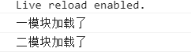

# ES6核心技术
- # 1.let&const
    - 建议使用let(语法类似java等语言 有作用域等概念)尽量不要用var

- # **2.deconstruction**(重点内容)
### 解构: 等号左边和右边类似
``` js
/* let a =12,
let b =5;
let c = 30;
console.log(a,b,c); */
/*这样记不住变量名字   改写为下面写法 
let arr = [12,5,30];
console.log(arr[0],arr[1],arr[2]); */


//改写为
let [a,b,c] = [12,5,30];
console.log(a,b,c);
```
### json
``` js
let json = {
    name :'Strive',
    age : 18,
    job:'码畜'
};
let {name,age,job} = json;
console.log(name,age,job);
```
遇到json或者数组可以解构
  - 理解变量的解构赋值
  - 最主要是**数组 对象**解构

## 数组
    - 解构:
        - 要对数组中的name和age赋值
    - 以前是这样做的
    - - -    
``` js
    //数组[]的解构
    数组:带[]
    let arr = ['zfpx',9];
    let name = arr[0];
    let age = arr[1];

    console.log(name,age);
 ```

    ************
    - ES6 允许写成下面这样

``` js
    let arr = ['zfpx',9];
    let [name, age] = arr;
    console.log(name,age);
```

    ## 对象
    对象:带{}
``` js
    let obj = { name: 'zfpx', age: 9 };
    //传来了两个参数   用三个变量接收,另一个用默认值
    //给name起别名n    name:n
    //给address起别名 address = "回龙观"
    let { name: n, age , address = "回龙观"} = obj;
    console.log(n, age, address);
```

    ## 复杂的解构 省略解构
    > (补充知识)
    - 省略第一项   拿到地址 和第三项的值
    - 代码结果是 回龙观  jw
``` js
    //复杂的解构 省略解构
    //省略第一项   拿到地址 和第三项的值
    //代码结果是 回龙观  jw
    let arr = [{ name: 'zfpx', age: '9' }, '回龙观', { name: 'jw' }];
    let [, address, { name }] = arr;
    console.log(address, name);
```
## 利用解构交换元素
``` js
    let a = 12;
    let b = 5;

    [a,b] = [b,a];
    // a = 5,b =12
    console.log(a,b);//5 12
```
## 利用解构返回封装函数的结果

``` js
//alert(top);

function getPos(){
    //xxx
    return {
        left:10,
        top:20
    }
}
let {left, top:t} = getPos();

console.log(left,t);//10,20
```
import {a,b,c} from './mod'


### 函数传参的解构
``` js
function show({a,b = '默认'}){
    console.log(a,b);
}

show({
    a:1,
    // b:2
})
```
### 这样写是函数参数的默认值
``` js
function show({a,b = '默认'} ={}){
    console.log(a,b);
}

show()

```
- # 3.string
    > 模板字符串
    - 使用反引号  (一对反引号将内容放入)
        - \`(内容)`
            - 优点:
                - 1.避免使用 + (加号)拼接字符串
                - 2.模板字符串可以换行
    - ## 实例一
    -----------------------------
    -  打印如下文本
    - "zfpx"今年9岁了
    -----------------------------
    - 以前是这样做的
    ``` js
    let name = 'zfpx';
    let age = 9;
    //要打印(引号)"要转义   \"  
    let str = "\"" + name + "\"" + '今年' + age + '岁了';
    console.log(str);
    ```

    -------------------------------
    - ES6 允许写成下面这样
    - > 语法规则(在一对反引号中添加内容)
    - -  \` 内容 ` 

    -  打印如下文本
    - ` "zfpx"`今年9岁了
    - ${name}   ${age}取出变量的值
    - 要打印(反引号)`要转义   \` 
    ``` js
    let name = 'zfpx';
    let age = 9;
  
    let str = `\` "${name}"\`今年${age}岁了`
    console.log(str);
    ```
    ----------------------------
    - ## 实例二
    ----------------------------
    ```
    -  打印如下文本
    <ul>
        <li>zfpx</li>
        <li>9</li>
    </ul>"
    ```

    - 以前是这样做的(结尾加\\且效果不好)
    - \r\n是换行
    ``` js
    let name = 'zfpx';
    let age = 9;


    let str = "<ul>\r\n\
        <li>${name}</li>\r\n\
        <li>${age}</li>\r\n\
    </ul>"
    console.log(str);
    ``` 
    - ES6 允许写成下面这样
    ``` js
    let name = 'zfpx';
    let age = 9;


    let str = `<ul>
        <li>${name}</li>
        <li>${age}</li>
    </ul>`
    console.log(str);
    ```
   > # <em>***带标签的标签模板***</em> (补充重点内容) 
   
   > 标签: 其实就是函数标签模板，
   这个名词不是很好理解，什么是标签模板？不懂没关系，前端君的任务就是负责把知识讲得通俗易懂，这里的模板指的是上面讲的字符串模板，用反引号定义的字符串；而标签，则指的是一个函数，一个专门处理模板字符串的函数。还是不完全理解？没事，继续往下看。
 
   ``` js
    var name = "张三";
    var height  = 1.8;

    tagFn`他叫${name},身高${height}米。`;
    //标签+模板字符串

    //定义一个函数，作为标签
    function tagFn(arr,v1,v2){
        console.log(arr); 
        //结果：[ "他叫","，身高","米。" ]
        console.log(v1); 
        //结果：张三
        console.log(v2); 
        //结果：1.8
    }

   ```
   以上代码有两处要仔细讲解的，首先是tagFn函数，是我们自定义的一个函数，它有三个参数分别是arr，v1，v2。函数tagFn的调用方式跟以往的不太一样，以往我们使用括号( )表示函数调用执行，这一次我们在函数名后面直接加上一个模板字符串，如下面的代码：
   ``` 
     tagFn`他叫${name},身高${height}米。`;
   ```
   这样就是**标签模板**，你可以理解为**标签函数+模板字符串**，这是一种新的语法规范。

   接下来我们继续看函数的3个参数，从代码的打印结果我们看到它们运行后对应的结果，arr的值是一个数组：[ "他叫" ,  "，身高"  ,  "米。" ]，而v1的值是变量name的值：“张三”，v2的值是变量height的值：1.8。       
   
   你是否看出规律了：第一个参数arr是数组类型，它是内容是模板字符串中除了${ }以外的其他字符，按顺序组成了数组的内容，所以arr的值是[ "他叫",  "，身高"  ,  "米。" ]；第2,3个参数则是模板字符串中对应次序的变量name和height的值。

    标签模板是ES6给我们带来的一种新语法，它常用来实现过滤用户的非法输入和多语言转换，这里不展开讲解。因为一旦我们掌握了标签模板的用法后，以后就可以好好利用它的这个特性，再根据自己的需求要来实现各种功能了。

    除了模板字符串和标签模版，ES6还为字符串String类扩展了不少函数。我们一起来学习它们：

    **repeat( )函数**：将目标字符串重复N次，返回一个新的字符串，不影响目标字符串。

    ``` js
    var name1 = "前端君";  //目标字符串
    var name2 =  name1.repeat(3);
    //变量name1被重复三次；

    console.log(name1); 
    //结果：前端君

    console.log(name2);
    //结果：前端君前端君前端君

    ```

    重复3次后返回一个新字符串赋值给name2，name1不受影响，所以name1的值不变。

    **新特性：includes函数**

    includes( )函数：判断字符串中是否含有指定的子字符串，返回true表示含有和false表示未含有。第二个参数选填，表示开始搜索的位置。

    ``` js
    var name = "前端君";    //目标字符串
    name.includes('君');   
    //true, 含有

    name.includes('web');  
    //false, 不含有

    name.includes('前',1); 
    //false, 从第2个字符开始搜索, 不含有
    ```

    传统的做法我们可以借助**indexOf( )函数**来实现，如果含有指定的字符串，**indexOf( )函数**就会子字符串首次出现的位置，不含有，则返回-1。我们通过返回值是否为-1来判断字符串中是否含有指定的子字符串，但是，我们现在可以用**includes( )函数**代替**indexOf( )函数**，因为它的返回值更直观（true或false），况且我们并不关心子字符串出现的位置。

    **注意**，上面最后一句代码，第二个参数为1，表示从第2个字符“端“开始搜索，第一个字符”前“的位置是0；

    ------------------------------
    **新特性：startsWith函数**

    **startsWith( )函数**：判断指定的子字符串是否出现在目标字符串的开头位置，第二个参数选填，表示开始搜索的位置。

    ``` js
    var name = "前端君";  //目标字符串

    name.startsWith('前'); 
    //true，出现在开头位置

    name.startsWith('端'); 
    //false，不是在开头位置

    name.startsWith('端',1); 
    //true，从第2个字符开始
    ```
    我们如果判断字符串是否以某个子字符串开头，就可以直接使用**startsWith( )函数**即可，同样，第二个参数为1表示从第2个字符开始搜索。若要从第一个字符开始搜索，参数应该为0或者为空（默认从第一个字符开始搜索）。

    **新特性：endsWith函数**

    **endsWith( )函数**：判断子字符串是否出现在目标字符串的尾部位置，第二个参数选填，表示针对前N个字符。

    ``` js
    var name = "我就是前端君";    //目标字符串

    name.endsWith('我');
    //false，不在尾部位置


    name.endsWith('君'); 
    //true，在尾部位置


    name.endsWith('君',5); 
    //false，只针对前5个字符


    name.endsWith('君',6);
    //true，针对前6个字符

    ``` 
    --------------------------
    **新特性：codePointAt函数**

    **javascript**中，一个字符固定为2个字节，对于那些需要4个字节存储的字符，**javascript**会认为它是两个字符，此时它的字符长度length为2。如字符："?"，就是一个需要4个字节存储，length为2的字符。这会有什么问题呢？对于4字节的字符， **javascript**无法正确读取字符，我们来试试看。

    ``` js
    var str1 = "前端";
    var str2 = "?";

    str1.length; //length为2
    str2.length; //length为2

    str1.charAt(0);  //前
    str1.charAt(1);  //端

    str2.charAt(0);  //'�'
    str2.charAt(1);  //'�'

    ```

    可以看到，**str1**和**str2**的长度**length**都是**2**，因为字符"?"是一个 **4**字节的字符，使用**charAt函数**（**charAt() 方法**可返回指定位置的字符）能正确读取字符串**str1**的字符，但无法正确读取**4**个字节的字符,此时返回结果出现了乱码。       但是，如果我们使用**ES6**给我们提供的**codePointAt**( )函数，就可以处理这种**4**个字节的字符了，我们来看看怎么使用：

    ``` js
    var str = "?";
    str.codePointAt();  //结果:134071
    ```
    对于这个长度**length**为**2**字符：**"?"，codePointAt( )方法**可以正确地识别出它是个**4**个字节的字符，并且能正确地返回它的码点的十进制数：**134071**，这个数字抓换成**16**进制就是**20bb7**，对应的**Unicode**编码则是**\u20bb7**。（什么是**Unicode**编码？稍后讲解）。

    什么？十进制的数字**134071**就是对应**4**个字节的字符：**"?"** 了？能不能验证一下？通过**134071**这个数字反推回去，得到字符：**"?"**？

    可以的，**ES6**还提供了一个函数给我们来实现这个效果。

    -------------------------------------
    **新特性：String.fromCodePoint函数**


    **String.fromCodePoint( )函数**：函数的参数是一个字符对应的码点，返回的结果就是对应的字符，哪怕这个字符是一个**4**字节的字符，也能正确实现。

    正好可以利用上面得到的**10**进制数字**134071**反推一下。

    ``` js
     String.fromCodePoint(134071); //结果："?"
    ```
    得到了我们预期的结果：**"?"**；同时也证明了上面的**codePointAt( )** 函数能正确读取**4**个字节的字符。

    ----------------------
    **新特性：String.raw函数**

    最后讲解的一个函数是**String.raw( )**；看函数名**raw**是未加工的的意思，正如这个函数的作用一样：返回字符串最原始的样貌，即使字符串中含有转义符，它都视而不见，直接输出。举个例子：

    未经**String.raw( )处理**的字符串：

    ``` js
     console.log(`hello\nworld`);
    //输出：hello
    //        world
    ```
    
    \n会被识别为换行符，实现换行效果，而经过<b>String.raw( )</b>的同一个字符串的结果是：

    ``` js
        console.log(String.raw`hello\nwolrd`);
    //输出：hello\nwolrd
    ```
    \n被识别为\和n两个字符，失去换行的效果，直接输出，这就是<b>String.raw( )</b>的功能。它常用来作为一个模板字符串的处理函数，也就是直接在后面加一个模板字符串。


    不知道学到这里，上面讲的模板字符串和标签模板是否已经忘得差不多了。不过能坚持认真看到这里的同学，算很认真刻苦了！

    总结：**ES6给字符串带来了很多实用性的扩展：模板字符串，标签模板，repeat函数、includes函数，startsWith函数，endsWith函数，codePointAt函数，String.fromCodePoint函数，String.raw函数。还顺带学习了一些关于Unicode编码的知识。**


    ----------------------------------- 
   - 要打印下面的内容(将字母改成大写)
     - ZFPX今年NINTH岁
     - 传入参数是小写 
   ------------------------------------
   -ES6 

        想要有一种工作方法
        可以将改成大写的方法提取出来
        对所有的变量 统一处理
        构建标签模板 ()
    ------------------------------------
``` js
    let name = 'zfpx';
    let age = '9';
    function tag(strings) {//string      [ '', '今年', '岁了' ]
        let args = Array.prototype.slice.call(arguments,1);//去掉传入数组的第一给空值
        console.log(args); //[ 'zfpx', '9' ]
        let str = '';
        for (let i = 0; i < args.length; i++) {
            str += (strings[i] + args[i].toString().toUpperCase());
        }
        str += strings[strings.length - 1];//没有这句是   ZFPX今年9   加上后可以拼接"岁了"
        return str;
    }
    let str = tag `${name}今年${age}岁了`;
    console.log(str);

```

        
   ************************************
   - 以前是这样做的
     - 改大写: 调用 toUpperCase()方法
``` js
    let name =  'zfpx';
    let age =  'ninth';

    let str = `${name.toUpperCase()}今年${age.toUpperCase()}岁了`;
    console.log(str);
   ```
    
- # **4.函数**(重点内容)
  > 1、为参数设置默认值：     
  （1）直接为参数设置默认值      
  （2）与解构赋值结合为参数设置默认值，此时需要注意，传入实参时必须传入一个对象为解构赋值解构赋值，否则会报错，因此可以先对函数参数设置默认值（空对象），即对解构赋值解构设置默认值（空对象），这样当传入的实参为空或者为非对象类型时，可以先用函数默认参数对解构赋值结构进行赋值，从而不会报错来完成对函数参数设置默认值。     （3）设置默认值的参数需放在参数体的尾部，因为此时可以省略设有默认值的参数，否则不能省略设有默认值的参数（省略会报错），除非用undefined代替设有默认值的参数的位置来触发默认值。      
  （4）解构赋值结构中也可使用之前定义过的变量来设置默认值（一定要定义过，不过在之前的参数中还是在父作用域中，否则会报错），顺便说下（我原先都不知道），形参中和函数体中的同名变量可以同时存在，互不影响，访问时函数体内的变量优先。
 
 ------------------------------------
 ``` js
    //函数参数默认值的设定
    function f(a = 1, b = 2) {
        return a + b;
    }

    console.log(f());//3 当没有实参传入时,使用默认参数值
    console.log(f(3));//5 a=3 b=2


    //与解构赋值结合设定参数的默认值
    function f1({ a = 1, b = 2 }) {//默认值a = 1, b = 2
        return a + b;
    }
    console.log(f1({ a: 3, b: 4 }));//7
    console.log(f1({}));//3 使用默认值
    //console.log(f1());//报错，没有传入函数参数对象，因此这种写法必须传入参数为一个对象，否则将会报错

    function f2(a = 0, { b = 1, c = 2 } = {}) {//第一个参数默认值 a = 0  给函数参数设定了默认值{}  b和c采用函数参数默认值{}对解构赋值进行赋值，得到b=1，c=2
        return a + b + c;
    }
    console.log(f2());//3 这种写法给函数参数设定了默认值{}，当传入的参数为非对象的时候，使用函数参数默认值对解构赋值设定默认值
    console.log(f2(4));//7   a变量采用传入的实参4，b和c采用函数参数默认值{}对解构赋值进行赋值，得到b=1，c=2

    function f3(a=0,{b,c}={b:1,c:2}){
        return a+b+c;
    }
    //这种写法只是将解构赋值的默认值移到了函数参数默认值里,效果是一样的

    //函数参数默认值总结（解构赋值结构）：当传入的实参为空或为非对象时，如果函数设定了函数参数默认值对象，函数默认参数对象会赋值给解构赋值结构，
    //否则没有函数默认参数对象时，将会报错。当传入的实参为对象时，即使函数设定了函数参数默认值对象也毫无作用，传入的参数对象会直接对解构赋值解构进行赋值


    //函数参数默认值的位置   
    //当设定默认值的参数设定在参数体尾部时，可以省略设定默认值的参数
    //当设定默认值的参数没有设定在参数体尾部时，而且参数体尾部有没有设定默认值的参数，此时设定默认值的参数不可以省略，除非用undefined代替，触发默认值

    function f4(a=3,b){
        return a+b;
    }

    //console.log(f4(,4))//报错
    console.log(f4(undefined,3));//6  使用undefined触发默认值

    function f5(a,b=4){
        return a+b;
    }

    console.log(4);//8 可以省略设置默认值的参数


    //函数的length属性

    function f5(a,b,c=8){
        return a+b+c;
    }

    console.log(f5.length);//2   length属性为函数参数中没有设置默认值参数的个数


    //函数参数默认值的作用域
    function f6(a,b=a){
    return a+b;
    }

    console.log(f6(4));//8  此时函数默认值设定的是函数中的一个形参，需要注意设置默认值时要保证变量已经被定义，获取变量值时会用当前作用域向上查找

    var a_f7 = 6;
    function f7(b=a_f7){
        return b;
    }

    console.log(f7());//6 f7作用域中无a_f7，会向父作用域中查找

    function f8(x,f=function(){x=2;}){
        var x = 12;
        f();
        return x;
    }

    console.log(f8(4));//12  形参中的变量和函数体声明的变量互不影响  查找会先查找函数体中，再去查找形参中

 ```

    >  ... 拓展运算符
     
        - 用来获取多余的参数（会将参数组合成一个数组名为args，比arguments要方便许多，arguments只是类数组对象）。
        - 将数组元素展开为元素序列

``` js
    //使用字符串拼接  和join eval方法
    //求和 将结果为$21    货币符+金额
    //...将函数剩下的参数 变成数组,只能放在参数的最后面 
    function sum(currency,...args){
        return currency + eval(args.join('+'));//方法用于把数组中的所有元素放入一个字符串。
    }
    console.log(sum('$',1,2,3,4,5,6));
```


- ## 箭头函数 (新特性)    
> =>

> let show = () => 1;(一条语句 可省略return)

> () => return 的东西

> 完整格式(多条语句)
```
() =>{
      语句    
      return (该return return)
}
```
- 例一

|以前|ES6|
|:---|:---:|
|function show() {|let show = () => 1;|
|return 1;|console.log(show());|
|}|
|console.log(show());|

- 例二

    以前
    ```
        function show(a, b) {
            return a + b;
        }
        console.log(show(12, 5));
    ```

     ES6
    ```
        let show = (a, b) => a + b;
        console.log(show(12, 5));
    ```

- 例三
    ```
        let show = (a = 12, b = 5) => {
            console.log(a,b);
            //return a + b;
        }
        show();
```

``` 
    //在浏览器console 下运行
    //10
    var id = 10; //用var定义一个全局变量,属于window,let,const不同
    let json = {
        id: 1,
        show: function () {
            setTimeout(function () {
                alert(this.id);
            }, 2000);
        }
    };
    json.show();
```

``` 
    //在浏览器console 下运行
    //1
    var id = 10; //用var定义一个全局变量,属于window,let,const不同
    let json = {
        id: 1,
        show: function () {
            setTimeout( () =>{
                alert(this.id);
            }, 2000);
        }
    };
    json.show();
```
箭头函数中没有 arguments
``` 
    function show() {
        console.log(arguments);
    }
    show(1,2,3,4,5);
``` js
let show = ()=>{
    console.log(arguments);//出错
}
show(1,2,3,4,5);

```


``` js
//使用...后
//修改后
//结果是     [ 1, 2, 3, 4, 5 ]
let show = (...args)=>{
    console.log(args);
}
show(1,2,3,4,5);

```

- 注意:
    - 1.this问题:定义函数所在的对象,不在是运行时所在的对象
    - 2.arguments:箭头函数中没有 arguments,用<b> '...'</b>
    - 3.箭头函数不能当构造函数用
    - 4.函数参数最后面的逗号可以有了

``` js
function show() {
    this.name = 'abc';
}
let s = new show();
console.log(s.name);
```

``` js
//TypeError: show is not a constructor
let show = () =>{//错误
    this.name = 'abc';
}
let s =new show();
console.log(s.name);
```

```
//函数参数最后面的逗号可以有了
function show(a,b,c,d,) {
    console.log(a,b,c,d);
}
show(1,2,3,4,);
```
- 
     <font size = '6' color='red'>注意 this的调用问题(重要补充)</font>
     

- 对第4个重要技术的总结
    - 函数变化 
        - 1.函数默认值
          - 函数参数默认定义问题
        - 2.与解构赋值连用
    - 扩展运算符 rest运算符
        - ...  三个点
            - 展开数组 
            - ...: 
                - [1, 2, 3, 4] -> ...[1,2,3,4] ->1,2,3,4
                - 1,2,3,4 -> ...1,2,3,4 ->[1, 2, 3, 4]
            - 也叫剩余运算符 rest 收集 必须放到最后
                - 对数组的使用
                - 对对象的使用  
            - 与函数的关联
                - 1.函数默认值
                - 2.与解构连用
        ---------------------------
        - 1.函数默认值
        ``` js
            //函数默认参数
        function show(a,b) {
            //用两个参数接收
            console.log(a,b);//结果是  welcome 牧马人
        }
        show('welcome','牧马人');//传两个参数

        //为了保证函数的通用性
        //有一天  '牧马人'不想打了打一个空字符串   函数改写为

        function show(a,b) {
            //用两个参数接收
            console.log(a,b);//结果是 welcome
        }                      //牧马人被清空
        show('welcome','');//传两个参数

        //如果不传参数
        //结果是welcome undefined

        function show(a,b) {
            //用两个参数接收
            console.log(a,b);//结果是 welcome undefined
        }                      
        show('welcome');//传两个参数

        //代码进一步改成
        function show(a,b) {
            a = a || '欢迎';
            b = b||'mmr';//传来的参数b 看有b吗没有就是mmr
            console.log(a,b);//结果是 welcome undefined
        }                      
        show('','牧马人');//传两个参数 第一个参数传了   第一个参数是 空 

        //ES更新后   可以添加默认值  
        //将上一个代码修改为
        function show(a='欢迎',b='mmr') {
            console.log(a,b);//结果是 welcome undefined
        } 
        show('welcome','牧马人');  //welcome 牧马人
        show('welcome','');  //welcome 第二个参数被清空
        show('welcome');//welcome mmr   第二个参数没传  
        show('','牧马人');// 牧马人   第一个参数被清空
        show(false,'牧马人');//false '牧马人'
        //show(,'牧马人');//Unexpected token 第一个参数必须传
        
        ```
        - 2.与解构连用
        ``` js
        //与解构的连用

        function show({ x, y }) {
            console.log(x, y);//1 1
        }
        show({ x: 1, y: 1 });


        function show({ x = 0, y = 0 }) {//默认值是0
            console.log(x, y);//1 1
        }
        show({ x: 1, y: 1 });


        /* 给函数参数设定了默认值{}
        b和c采用函数参数默认值{}对解构赋值进行赋值，
        得到a=0，b=0 */
        function show({ x = 0, y = 0 }={}) {
            console.log(x, y);//1 1
        }
        show({ x: 1, y: 1 });
        ```

        - ## `函数参数默认定义的问题`
        ``` js
        //函数参数默认已经定义了,不能在使用let,const声明
        function show(a = 18) {
            let a = 101;//错误  函数参数默认已经定义了
            console.log(a);
        }
        show(12);

        //调用时可以不给值  默认值a = 18
        //如果调用时给值  取给的值
        function show(a = 18) {
            console.log(a);
        }
        show();
        ```

- # 5.对数组的拓展

ES5里面新增的一些东西

    循环 
        1.for
                for(let i = 0;i <arr.length;i++)

        2.while

        arr.forEach()//代替普通for
``` js
                arr.forEach(function(val, index, arr) {
                    console.log(val, index, arr); 
                })
```
        arr.map()//非常有用 ,做数据交互  映射(一对一)
                正常情况下,需要配合return,返回是一个新的数组
                若是没有return ,相当于forEach()

                注意:平时只要用map,一定要有return 

                重新整理数据结构:
                    [title:'aaa'] -> [t:{'aaa'}]
``` js
                    let arr = [
                        { title: 'aaaaa', read: 100, hot: true },
                        { title: 'bbbbb', read: 100, hot: true },
                        { title: 'ccccc', read: 100, hot: true }
                    ];
                    let newArr = arr.map((item,index,arr)=>{
                        let json = {};
                        json.t = `^_^${item.title}------`;
                        json.r = item.read + 200;
                        json.hot = item.hot == true && '真棒!!!';
                        return json;
                    });

                    console.log(newArr);
```
        arr.filter() 过滤,过滤一些不合格'元素' ,如果回掉函数返回true,就留下来

        arr.some()   类似查找,数组里面某一个元素符合条件,返回true
```
                    //查找数组里面某一个元素
                    //例一
                    let arr = ['apple', 'banana', 'orange'];

                    let b = arr.some((val,index,arr) =>{
                        return val == 'banana2';//看数组中有无该元素    //返回值是true or false
                    });

                    console.log(b);


                    //例二
                    
                    let arr = ['apple', 'banana', 'orange'];

                    function findInArray(arr,item) {
                        return arr.some((val, index,arr) => {
                            return val == item;
                        });
                    }
                    console.log(findInArray(arr,'orange'));
``` 
        arr.every() 数组里面所有的元素都要符合条件,才会返回true
``` js
                    //数组中的每一个值都是奇数
                    let arr = [1,3,5,7,9,10];

                    var b = arr.every((val,index,arr) =>{
                        return val%2 ==1;//是奇数
                    });

                    console.log(b);//false
```


        其实他们可以接收两个参数:
                arr.forEach/map...(循环回掉函数,this指向谁)
        arr.reduce()   从左往右的
```
                    //求数组的和 1+2+....+10
                    let arr = [1,2,3,4,5,6,7,8,9,10];
                    let res= arr.reduce((prev,cur,index,arr)=>{
                        return prev + cur;
                    });
                    console.log(res);

                    //求数组的阶乘 (2^2)^4 = 64

                    ////求数组的阶乘 (2^2)^4 = 64
                    let arr = [2,2,3];

                    let res = arr.reduce((prev,cur,index,arr)=>{
                        return Math.pow(prev,cur);
                    });

                    console.log(res);//64

                    
```
                     //ES2017新增运算符
                    幂
                        **
                        Math.pow()
```
                        //console.log(Math.pow(2,3));

                        console.log(2**4);

```
        arr.reduceRight() 从右往左的

```
                    
                    let arr = [2,2,3];

                    let res = arr.reduceRight((prev,cur,index,arr)=>{//(3^2^2) = 81
                        return Math.pow(prev,cur);
                    });

                    console.log(res);//64
```
--------------------------------------------------------

## for  .....of....

- arr.keys()      数组下标
- arr.entries()   数组某一项

```
    let arr = ['apple', 'banana', 'orange', 'tomato'];
    for (let val of arr) {//默认就是arr.values()
        console.log(val);
    }
```

``` js

//for ...of 循环 
/* apple
banana
orange
tomato */
let arr = ['apple', 'banana', 'orange', 'tomato'];
for (let val of arr) {//默认就是arr.values()
    console.log(val);
}
/* 索引值 arr.keys()取索引值
0
1
2
3 */
for (let index of arr.keys()) {
    console.log(index);
}
/* arr.values()取值
apple
banana
orange
tomato
*/
for (let index of arr.values()) {
    console.log(index);
}
/*
索引 + 值 
[ 0, 'apple' ]
[ 1, 'banana' ]
[ 2, 'orange' ]
[ 3, 'tomato' ] */
for (let item of arr.entries()) {
    console.log(item);
}
/* item[0]索引值  item[1]值
0
1
2
3 */
for (let item of arr.entries()) {
    console.log(item[0]);
}
/*
0 'apple'
1 'banana'
2 'orange'
3 'tomato'
*/
for (let [key,val] of arr.entries()) {
    console.log(key,val);
}

```
 =================================================================  

 复习

    - 扩展运算符
    复制数据
    let arr = [1,2,3];
    let arr1 = [...arr];//将数组展开复制到新数组
    - 或使用
    let arr1 = Array.from(arr);//es5之前的方法
    let arr1 = [].slice.call(arr);//复杂点的写法

    Array.from
        作用:
        - 1.把类数组(获取一组元素,arguments)对象转成数组
        - 2.将数组切开
            - 切json对象
        个人观点:具备lenth这个东西,就靠谱
        let str = 'Strive';
        //let arr = str.split('');[ 'S', 't', 'r', 'i', 'v', 'e' ]
        let arr = Array.from(str);//[ 'S', 't', 'r', 'i', 'v', 'e' ]
        console.log(arr);

        //length =  3
        //[ 'apple', 'banana', 'orange' ] 

        //length =  2
        //[ 'apple', 'banana'] 
        let json = {
            0:'apple',
            1:'banana',
            2:'orange',
            length :3//没有length为空
        }
        let arr = Array.from(json);
        console.log(arr);
    Array.of()   把一组值  转成数组

        let arr = Array.of('apple','banana','orange');
        console.log(arr);
        /* 
        Array.of  = function (...args) {
            return args;
        }
        */

    arr.find()    找出第一个符合条件的数组成员,如果没有找到返回undefined(试一下)
        let arr = [23,900,101,80,100];
        let res = arr.find((val,index,arr) =>{
            return val>100;
        });
        console.log(res); //900
    arr.findIndex()   想找下成员的位置   找的是位置,没找到返回 -1
        let arr = [23,900,101,80,100];
        let res = arr.findIndex((val,index,arr) =>{
            return val>100;
        });
        console.log(res); //1


    arr.fill()填充
        arr.fill(填充的东西 , 开始位置,结束位置);
         //[ <1 empty item>, '默认值', '默认值', <7 empty items> ]   
        let arr = new Array(10);
        arr.fill('默认值',1,3);
        console.log(arr);

        在ES2016里面新增
            arr.indexOf() 返该元素的位置    
            arr.includes() 包含
                str.includes()
            --------------------------------------
            let arr = ['apple', 'banana', 'orange', 'tomato'];

            let b = arr.includes('orange');
            console.log(b);//true

            --------------------------------------
            let arr = ['apple', 'banana', 'orange', 'tomato'];

            let b = arr.indexOf('orange');
            console.log(b);//2
        - 总结
        总结：ES6为数组带来了很多很实用的方法：Array.of( )、Array.from( )、find( )、findIndex( )、fill( )、entries( )、values()，此外还有一个更简洁的语法：数组推导，能让我们更方便地生成一个新数组。

- # 6.对对象的扩展
    - 1.对象的简写
    - 2.Object.is()    用来比较两个值是否相等
    - 3.Object.assign()    - 用途
                            1.复制对象
                            2.合并参数
    ES2017引入:
        - 4.Object.keys();
        - 5.Object.entries();
        - 6.Object.values();
--------------------------------------------------
    - 1.对象的简写
        let json = {
            a:1,
            b:2,
            showA:function(){
                return this.a;
            }

            showB:function(){
                return this.b;
            }
        }
        ES6 简写为:
        let json = {
            a,
            b,
            showA(){//建议:一定注意,不要用箭头函数

            }
            showB(){

            }
        }

        new Vuex.Store({
            state,//是state : state 的简写
            mutation,
            types,
            actions
        })

        new Vue({
            router,
            App,
            vuex
        })

``` js
/* 对对象的扩展 */

let name = 'Strive';
let age = 18;

let json = {
    name,  //name:name,
    age,   //age:age
    /*  showA: function(){
        return this.name;
    } */
    showA() {
        return this.name;
    },
    showB() {
        return this.age;
    }
};
console.log(json.showA(), json.showB());//Strive 18
```

        复习下  解构(又称对象的简洁语法)

            let x = 10;
            let y = 20;
            function show({x,y}){
                console.log(x,y);
            }
            show({x,y});//10 20

    - Object.is()    用来比较两个值是否相等
    比较两个东西相等
        ==
        ===

    Object.is(NaN,NaN);

    Object.is(+0,-0)

``` js
        /* Object.is()   */

        // console.log(NaN == NaN);//false  两个对象不相等
        // console.log(Number.isNaN(NaN));//true


        /* Object.is()   看着长相 一样就相等 否则不相等*/
        let b = Object.is(NaN,NaN);
        console.log(b);//true

        console.log(+0 == -0);//true
        console.log(Object.is(+0,-0));//false  看着长相 一样就相等 否则不相等

        console.log(Object.is('aaa','aac'));//false
```
    - 3.Object.assign()    用来合并对象
    let 新的对象  = Object.assign(目标对象, source1, source2...)

    function ajax(option){//用户传来的参数
        let defaults = {
            type:'get';
            header,
            data:{}
            ...
        };
        let json = Object.assign({},defaults,options);//后面传的值会覆盖前面的
        ...
    }

    
/* 3.Object.assign()    用来合并对象 */


``` js
//将三个变量合并
let json = {a:1};
let json2 = {b:2};
let json3 = {c:3};

let obj = Object.assign({},json,json2,json3);
console.log(obj);//{ a: 1, b: 2, c: 3 }


let json = {a:1};
let json2 = {b:2,a:2};//后面传入a:2 会覆盖前面的a:1
let json3 = {c:3};

let obj = Object.assign({},json,json2,json3);
console.log(obj);//{ a: 2, b: 2, c: 3 }

//复制一个对象到另一个
let arr = ['apple', 'banana', 'orange'];
let arr2 = Object.assign([],arr);//将数组合并到新的数组     将数组复制一份到新的里面
arr2.push('tomato');//为数组2  添加变量
console.log(arr2);
console.log(arr);
```


- 4.Object.keys()
- 解构
    - let{keys,values,entries} = Object;
``` js
        //使用解构
    let {keys,values,entries} = Object;
    let json =  {
        a:1,
        b:2,
        c:3
    };
    for (let key of keys(json)) {
        console.log(key);
        /* 结果是       
        a
        b
        c 
        */
    }
    for (let value of values(json)) {
        console.log(value);
    }
    for(let item of entries(json)){
        console.log(item);
    }

    for(let [key,val] of entries(json)){
        console.log(key,val);
    }
```
## 对象身上:  对象的扩展运算
### 三个点  ...

``` js
/*对象身上:  对象的扩展运算*/
let {x,y,...z} = {x:1,y:2,a:3,b:4};
console.log(x,y,z);//1 2 { a: 3, b: 4 }


let json = {a:3,b:4};
let json2 = {...json};//拷贝json对象
console.log(json2);//{ a: 3, b: 4 }
delete json2.b;//删除json2的b
console.log(json2);//{ a: 3 }
console.log(json);//{ a: 3, b: 4 }
```
----------------------------------------
- # 7.Promise  承诺,许诺
    - promise.all() 需要对几个的对象,进行处理

作用:解决异步回调问题

传统方式,大部分用回调函数,事件

ajax(url,{//获取token
    ajax(url,()=>{//获取用户信息
        ajax(url,()=>{
            //获取用户相关新闻
        })
    })
})

语法

    let promise = new Promise(function(resolve, reject){
    //resolve 成功调用
    //reject 失败调用
    });

    promise.then(res=>{//.then then完后的结果用 res

    },err =>{

    });

    本人用法:
        new Promise().then(res =>{

        }).catch(err =>{

        });

    Promise.resolve('aa'):将现有的东西,转成一个promise对象,resolve状态,成功状态
        等价于
        new Promise(resolve =>{
            resolve('aaa');
        });

    Promise.reject('aaa'):将现有的东西,转成一个promise对象,reject状态,失败状态
        等价于
        new Promise((resolve, reject) =>{
            reject('aaa');
        });

``` js
// 例 1 
let a = 1;
let promise = new Promise(function(resolve, reject){
    //resolve 成功调用
    //reject 失败调用
    if (a == 10) {
        resolve('成功');
    } else {
        reject('失败');
    }
});
// promise.then(success,fail);

promise.then(res =>{//成功走这个
    console.log(res);
},err =>{         //失败走这个
    console.log(err);//失败
});

promise.catch(err =>{//reject,发生错误,别名 then()第二个参数err的别名
    console.log(err);//失败
})


//例 2
let a = 1;
let promise = new Promise(function(resolve, reject){
    //resolve 成功调用
    //reject 失败调用
    if (a == 10) {
        resolve('成功');
    } else {
        reject('失败');
    }
});
promise.then(res =>{//成功走这个
    console.log(res);
});

promise.catch(err =>{//reject,发生错误,别名 then()第二个参数err的别名
    console.log(err);//失败
})

//例 3
let a = 1;
let promise = new Promise(function(resolve, reject){
    //resolve 成功调用
    //reject 失败调用
    if (a == 10) {
        resolve('成功');
    } else {
        reject('失败');
    }
});
promise.then(res =>{//成功走这个
    console.log(res);
}).catch(err =>{
    console.log(err);//失败
});

//resolve
let p1 = Promise.resolve('aaa');
p1.then(res =>{
    console.log(res);//aaa
})


//等价于
let p1 = new Promise(resolve =>{
    resolve('aaa');
});

p1.then(res =>{
    console.log(res);//aaa
});

//reject
let p1 = Promise.reject('aaa');//第一句告诉promise是错误的
p1.then(res =>{
    console.log(res);
}).catch(err => {
    console.log(res);//aaa程序从这走
})
```
- ## Promise.all([p1,p2,p3]):
需要将引入的对象放到数组
把promise打包,扔到一个数组里面,打包完还是一个promise对象,
必须确保,所有的promise对象,都是resolve(成功)状态
``` js
/* Promise.all 对promise对象打包,打包完还是promise对象*/
let p1 = Promise.resolve('aaa');
let p2 = Promise.resolve('bbb');
let p3 = Promise.resolve('ccc');

Promise.all([p1,p2,p3]).then(res =>{
    //console.log(res);//[ 'aaa', 'bbb', 'ccc' ]

    //使用解构
    let [res1,res2,res3] = res;
    console.log(res1,res2,res3);//aaa bbb ccc
})
```
    - Promise.race([p1, p2, p3]):只要有一个成功,就返回

- 与ajax配合的一个实例
``` js
  // 与ajax配合的一个实例
//在浏览器运行

let status = 1;
let userLogin = (resolve,reject)=>{
    setTimeout(() => {
        if (status ==1) {
            resolve({data:'登录成功',msg:'xxx',token:'xxxxxx'});
        } else {
            reject('失败了');
        }
    }, 2000);
};
let getUserInfo = (resolve,reject)=>{
    setTimeout(() => {
        if (status ==1) {
            resolve({data:'获取用户信息成功',msg:'scscs',token:'ssss'});
        } else {
            reject('失败了');
        }
    }, 1000);
};
//将以上串起来  使用 Promise
new Promise(userLogin).then(res =>{
    //console.log(res);
    console.log('用户登陆成功');
    return new Promise(getUserInfo);
}).then(res =>{
    console.log('获取用户信息成功');
    console.log(res);
});
```

- # 8 模块化
    - js不支持模块化
        - ruby require
        - python import
    - 在ES6之前,社区制定的一套模块规范:
        - Commonjs           主要服务- 端 nodeJs   require('http')
        - AMD                - requireJS,curlJS
        - CMD                seaJS
    - ES出来,统一服务端和客户端的模块规范:
        - import{xx}  ddd

        - Math.pow()
        - Math.abs()

    - import{pow,abs} from 'Math'     我自己瞎想

- # 模块化:
    默认是  严格模式
    - 注意:需要放到服务器环境
        - a)如何定义模块?
            + export   东西
            + export const a = 12;
            + export{
                + a as aaa,
                + b as banana
            + }
            + 默认导出  default 不加花括号
        - b)如何使用?   
        - 引入模块
            - import
            - import './1.js';

            - import {a as aaa, banana, c} from './1.js';
            - import * as modTwo from './1.js';
    使用模块:
        <script type = 'module'></script>
    - import :特点
        - a)import可以是相对路径,也可以是绝对路径
                https://code.jquery.com/jquery-3.3.1.js
        - b)import模块只会导入一次,无论你引入多少次
        - c).import './1.js'如果这么用,相当于引入文件
        - 注意  
            - step1.开启服务器
            文件的相对路径   绝对路径问题
            - step 2
                //例程html文件路径为
                http://127.0.0.1:5500/modules/use-mod.html
                http://localhost:5500/modules/use-mod.html
        - d) 有提升效果,import 会自动提升到顶部,首先执行
        意思是 import 这句话会自动提升到\<script>第一行
```
<script type = 'module'>
        console.log(a + b);///17
        import {a,b} from './1.js'
</script>
```
                    
                    const a = 12;
                    const b = 5;

                    export {
                         a,
                         b,
                     }
- e) 导出去的模块内容,如果里面有定时器更改,外面也会改动,不像Common规范缓存
```
        //12
        //1111    三秒后变为1111
        <script type = 'module'>
                import {a,b} from './1.js'
                console.log(a);///12

                setTimeout(()->{
                    console.log(a);//1111
                },3000)
        </script>

            
            let a = 12;
            let b = 5;

            setTimeout(()->{
                a = 1111;//两秒后改为1111
                console.log(a);
            },2000)
            export {
                    a,
                    b,
                }
```
-  f) import()  
- import加括号函数 类似node里面的require,可以动态引入 
- 默认import语法不能写到 if   for 之类里面
返回值,是个promise 对象(可以用 then ,Promise.all)
- 就是根据不同的条件,引入不同的js文件
- 动态引入 (一)
```
    <script type = 'module'>
    let a = 12;
    if(a == 12){
    import {a} from './1.js'
    }else{
    import {a} from './2.js'
    }
    </script>
```
以上这种语法是错误的

- 只能先引用后使用
- 如果想要动态引入 使用import()这种方式即可
```
    <script type = 'module'>
    //遵循Promise规范
    import('./1.js').then(res =>{//成功时调用
        console.log(res.a + res.b);
    });
    </script>
```
                ```  js
                let a = 12;
                let b = 5;
                ```

                - 动态引入 (二)
                   <script type = 'module'>
                    //遵循Promise规范
                        import('https://code.jquery.com/jquery-3.3.1.js').then(res =>{//成功时调用
                            $(function(){
                                $('body').css({
                                    background:'gray'
                                })
                            })
                        });
                    </script>

                优点:
                    1.按需加载
                    2.可以写在if中
                    3.路径也可以动态
                        路径动态加载 
                        <script type = 'module'>
                            let sign = 1;
                            function config(){
                                switch(sign){
                                    case 1:
                                        return './1.js';
                                        break;
                                    case 2:
                                        return './2.js';
                                        break;
                                }
                            }
                            import(config(1)).then(res =>{修改 这里的 1 动态调用
                                $(function(){
                                    $('body').css({
                                        background:'gray'
                                    })
                                })
                            });
                        </script>
- promise.all 
- 一堆对象进行处理的动态引入  举例

            <script type="module">
            Promise.all([
                import('./1.js'),
                import('./2.js'),
            ]).then(([mod1,mod2]) =>{//返回结果用[mod1,mod2]进行解构
                console.log(mod1);
                console.log(mod2);
            })
        </script>
        
        1.js
        console.log("一模块加载了");
        2.js
        console.log("二模块加载了");
    
    ==========================================
    - ES2017 加async await
    - 如果你愿意可以和之前的任何一个语法规则合并
```
    <script type="module">
            async function main(){
                const mod1 = await import('./1.js');
                const mod2 = await import('./2.js');
                console.log(mod1,mod2);
                const [m1,m2] = await Promise.all([
                    import('./1.js'),
                    import('./2.js')
                ]);
                console.log(m1,m2);
    }
            main();//调用main函数
    </script>
```
- 'use strict'      以后默认就是严格模式
    如 - 变量先定义后使用
    等等
```  
        - 1
        - 2
        - 别名 as
        - 依赖导入
        modules - 1
        ``` js
        //第一种写法
        /* export const a = 12;//导出模块
        export const b = 5;
        export let c = 101;
        console.log(1111);
        */

        // //换一种写法

        // const a = 12;//定义的是常数 a  不能改动
        // const b = 5;
        // const c = 101;

        // export {
        //     a,
        //     b,
        //     c
        // }


        //别名
        const a = 12;
        const b = 5;
        const c = 101;

        export {
            a as aaa,
            b as banana,
            c as cup
        }
```

``` html
<!DOCTYPE html>
<html>
<head>
    <meta charset="utf-8" />
    <!-- <meta http-equiv="X-UA-Compatible" content="IE=edge"> -->
    <title>Page Title</title>
    <!-- <meta name="viewport" content="width=device-width, initial-scale=1"> -->
    <script type = 'module'>
    /*  //引入模块
        import 'https://code.jquery.com/jquery-3.3.1.js';
        setTimeout(() => {
            $(function () {
                $('body').css({
                    background:'red'
                })
            })
        }, 3000); */
        //引入模块
    /*  import {aaa, banana, cup} from './1.js';
        console.log(aaa, banana, cup); */

/*          import {aaa as a, banana as b, cup as c} from './1.js';
        console.log(a, b, c);  */

        //引入所有的东西   import *
        import * as modTwo from './1.js';
        console.log(modTwo);//Module {Symbol(Symbol.toStringTag): "Module"}
        console.log(modTwo.aaa);//12
    </script>
</head>
<body>
    
</body>
</html>
```


- 例
- 默认导出  default 不加花括号
- modules - 2
+ 1.js
>> 
    export default 12;
    export const cc= 12;
    export const dd = 5;

``` html
<script type = 'module'>
import a,{cc,dd} from './1.js'
console.log(a,cc,dd)//12,12,5
</script>
```
- 例  
- 引入模块与导入模块结合(综合)
- modules - 3
``` html 
<!DOCTYPE html>
<html>
<head>
    <meta charset="utf-8" />
    <meta http-equiv="X-UA-Compatible" content="IE=edge">
    <title>Page Title</title>
    <meta name="viewport" content="width=device-width, initial-scale=1">
    <script type='module'>
        import mod,{show,sum,a,b} from './1.js'
        let p1 = new mod.Person('张三');
        console.log(p1.showName());
        show();

        sum();

        console.log(a,b);
    </script>
</head>
<body>
    
</body>
</html>
```
``` js
const a = 12;
const b = 5;

const sum = () => {
    console.log(a + b);
    return a + b;
}

const show = () =>{
    console.log("执行了show");
    return 1;
}

class Person{
    constructor(name, age){
        this.name = name;
        this.age = age;
    }
    showName(){
        return `我的名字是${this.name}`;
    }
}

export{
    a,
    b,
    sum,
    show
}
export default {
    Person
}
```
- 依赖导入
+ 2.js
>>
    //2.js
    export const a= 102;
    export const b = 5;
```
``` js 
// const a = 12;
// const b = 5;
import {a,b} from '../modules-2/2.js'
const sum = () => {
    console.log(a + b);
    return a + b;
}

const show = () =>{
    console.log("执行了show");
    return 1;
}

class Person{
    constructor(name, age){
        this.name = name;
        this.age = age;
    }
    showName(){
        return `我的名字是${this.name}`;
    }
}

export{
    a,
    b,
    sum,
    show
}
export default {
    Person
}
```
- modules - 2/ 2.js
``` 
//2.js
export const a= 102;
export const b = 5;
```
``` html
<!DOCTYPE html>
<html>
<head>
    <meta charset="utf-8" />
    <meta http-equiv="X-UA-Compatible" content="IE=edge">
    <title>Page Title</title>
    <meta name="viewport" content="width=device-width, initial-scale=1">
    <script type='module'>
        import mod,{show,sum,a,b} from './1.js'
        let p1 = new mod.Person('张三');
        console.log(p1.showName());
        show();

        sum();

        console.log(a,b);
    </script>
</head>
<body>
    
</body>
</html>
```
- # 9. 类 (Class)
程序中的类

ES6

面向对象   ,类

函数模拟, 类
    属性
    方法

函数模拟

人:Person
    属性:name
    展示名字:showName

    调用方法,使用Person.prototype.showName
ES5之前:
    function Person(){
        this.name = 'aaa';
    }
    Person.prototype.showName = function(){}

- 一种写法

``` html
<!DOCTYPE html>
<html lang="en">

<head>
    <meta charset="UTF-8">
    <meta name="viewport" content="width=device-width, initial-scale=1.0">
    <meta http-equiv="X-UA-Compatible" content="ie=edge">
    <title>Document</title>
    <script>
        function Person(name, age) {
            this.name = name;
            this.age = age;
        }
        /* 绑定方法  使用prototype */
        Person.prototype.showName = function () {
            return `名字为: ${this.name}`;
        };
        Person.prototype.showAge = function () {
            return `名字为: ${this.age}`;
        };

        /* //另一种 绑定方法
        //Object.assign(tar,sou) 合并对象从一个或多个源对象复制到目标对象。它将返回目标对象。
        Object.assign(Person.prototype, {
            showName() {
                return `名字为: ${this.name}`;
            },
            showAge() {
                return `名字为: ${this.age}`;
            }

        }) */
        let p1 = new Person('Strive', 18);
        console.log(p1.showName());
        console.log(p1.showAge());
    </script>
</head>

<body>

</body>

</html>
```    
- 另一种写法
``` html
<!DOCTYPE html>
<html lang="en">

<head>
    <meta charset="UTF-8">
    <meta name="viewport" content="width=device-width, initial-scale=1.0">
    <meta http-equiv="X-UA-Compatible" content="ie=edge">
    <title>Document</title>
    <script>
        function Person(name, age) {
            this.name = name;
            this.age = age;
        }

        //另一种 绑定方法
        //Object.assign(tar,sou) 合并对象从一个或多个源对象复制到目标对象。它将返回目标对象。
        Object.assign(Person.prototype, {
            showName() {
                return `名字为: ${this.name}`;
            },
            showAge() {
                return `名字为: ${this.age}`;
            }
        })
        let p1 = new Person('Strive', 18);
        console.log(p1.showName());
        console.log(p1.showAge());
    </script>
</head>

<body>

</body>

</html>
```    
- # Class(ES6 中的变形)
    >
    >class Person{
    >    construction(){
    >       this.name = 'aaa'
    >    }
    >   showName(){}
    >
    >}
    ``` js
    class Person{
        constructor(name, age){//构造方法(函数),调用new,自动执行
            //console.log(`构造方法执行了,${name},${age}`);
            this.name = name;
            this.age = age;
        }
        //定义方法
        showName(){
            return `名字为: ${this.name}`;
        }
        showAge(){
            return `年龄: ${this.age}`;
        }
    }
    let p1 = new Person('Strive',18);
    console.log(p1.showName(),p1.showAge());
    ```
    -------
    const Person = class{

    }
    -------
    - 方法的名字允许为  
    - 表达式\[a + b](){}
    >>
        let a = 'strive';
        let b = 'method';
        class Person{
            [a + b](){//方法

            }
        }
------
        let aaa = 'aaa';
        let bbb = 'ddd';
        let json = {
            [aaa + bbb]: 'welcome 51mmr.net'
        }

``` js 
let aaa = 'strive';
let bbb = 'method';
class Person{
   [aaa + bbb](){//方法
       return '随便了...'
   }
}
let p1 = new Person('Strive',18);
console.log(p1[aaa + bbb]());//随便了
//等同于
//console.log(p1.strivemethod());
```
注意:
1. ES6 类没有提升功能,在ES5 ,用函数模拟可以,默认函数提升
2. ES6里面的this 比之前轻松多了
矫正this
    1.fn.call(this指向谁,arg1,arg2...)
    2.fn.apply(this指向谁,[arg1,arg2...])
    3.fn.bind()
-----------------------------------------------------
class里面取值函数(getter),存值函数(setter)
``` js
class Person{
    constructor(){

    }
    get aaa(){//get(aaa属性的)取值函数
        return `aaa的属性`;
    }
    set aaa(val){//set(aaa属性的)函数  设置值val
        console.log(`设置aaa属性,值为${val}`);
    }
}
let p1 = new Person();
p1.aaa = '123';
console.log(p1.aaa);//有get取值函数才能正确
```
静态方法:就是类身上的方法  
- static xxx()
父类.aaa();
``` js
/* 如果想要用类去调用使用静态方法
Person.xxx()
static xxx(){

}
 */
class Person{
    constructor(){

    }
    showName(){
        return '这是showName方法';
    }
    //想使用类去调用 加static关键字
    static aaa(){
        return '这是静态方法';
    }
}
let p1 = new Person();
console.log(p1.showName());//这是showName方法
console.log(Person.aaa());//这是静态方法
```
--------------------------------------
父类

子类

继承  (子类可以继承父类的东西)

Person
Student
- 之前
``` js
//父类
function Person(name) {
    this.name = name;
}

Person.prototype.showName = function(){
    return `名字是:${this.name}`;
}

//子类
function Student(name,skill) {
    Person.call(this,name);//继承属性
    this.skill = skill;
}
Student.prototype = new Person();//继承方法

//调用
let stu1 = new Student('Strive','逃学');
console.log(stu1.name);//Strive
console.log(stu1.showName());//名字是:Strive
```
- 现在:
>>
    extends
    class Student extends Person{

    }
``` js
    //父类
    class Person{
    constructor(name){
        this.name = name;
    } 
    showName(){
        return `名字为:${this.name}`;
    }
    }
    //子类
    class Student extends Person{//继承父类

    }
    let stu1 = new Student('Strive','逃学');
    console.log(stu1.showName());//名字为:Strive
```

- 完善 子类有单独的方法
```
//父类
class Person{
   constructor(name){
       this.name = name;
   } 
   showName(){
       console.log('父类的showName');
       return `名字为:${this.name}`;
   }
}
//子类
class Student extends Person{//继承父类
    constructor(name,skill){
        super(name);//
        this.skill = skill;
    }
    showName(){
        //父级的方法执行
        super.showName();//还想调用父类的showName 使用super.showName
        //做自己的事情
        console.log('子类里的showName');
    }
    showSkill(){
        return `我的技能为:${this.skill}`;
    }
}
let stu1 = new Student('Strive','逃学');
console.log(stu1.showSkill());//我的技能为:逃学
console.log(stu1.showName());//重载 子类里的showName
                                //undefined 因为该函数没有返回值有 undefined
```

- 实用项目拖拽

下面的代码可以让两个div进行拖拽
``` html
<!DOCTYPE html>
<html lang="en">
<head>
    <meta charset="UTF-8">
    <meta name="viewport" content="width=device-width, initial-scale=1.0">
    <meta http-equiv="X-UA-Compatible" content="ie=edge">
    <title>Document</title>
    <style>
        .box{
            width: 100px;
            height:100px;
            background: red;
            position: absolute;
            top: 0px;
        }
        .left{
            left:0;
        }

        .right{
            right: 0;
        }
    </style>
  
</head>
<body>
    <div id = "div1" class="box left">DIV1</div>
    <div id = "div2" class="box right">DIV2</div>

    <script>
        //普通拖拽 父类
            class Drag{
                constructor(id){
                    this.oDiv = document.querySelector(id);
                    this.disX = 0;//div在左在右边的距离
                    this.disY = 0;
                    this.init();
                }
                init(){
                    this.oDiv.onmousedown = function(ev){
                        this.disX = ev.clientX - this.oDiv.offsetLeft;
                        this.disY = ev.clientY - this.oDiv.offsetTop;
    
                        document.onmousemove = this.fnMove.bind(this);
                        document.onmouseup = this.fnUp.bind(this);
                        return false;//禁止选中 div文字
                    }.bind(this);
                }
    
                fnMove(ev){
                    this.oDiv.style.left = ev.clientX - this.disX + 'px';
                    this.oDiv.style.top = ev.clientY - this.disY + 'px';
                }
                fnUp(ev){
                    document.onmousemove = null;
                    document.onmouseup = null;
                }
            }
            //子类 限制范围
            class LimitDrag extends Drag{
                fnMove(ev){
                    super.fnMove(ev);//为了不冲掉父类的方法  调用父类方法super.fnMove
//如果注掉这句代码将不能移动 div 
                    //限制范围
                    if(this.oDiv.offsetLeft <= 0){
                        this.oDiv.style.left = 0;
                    }
                    if(this.oDiv.offsetTop <= 0){
                        this.oDiv.style.top = 0;
                    }
                }
            }
            //调用 希望可以拖拽
            new Drag('#div1');
            new LimitDrag('#div2');
        </script>
</body>
</html>
```


- # 10. symbol & generator
----------------------------
>>
    数据类型:
        number,string,boolean,Object,undefined,function...

        用typeof检测出来数据类型:
            symbol

        new Number(12);
        new String()
        new Array()

    symbol (私有的)使用情况一般
    定义:
        let syml = Symbol('aaa');

        console.log(syml);
    注意:
        1.Symbol不能new
        let syml = new Symbol('aaa');//这样的语法是错误的 不能new
        2.Symbol()返回是一个唯一值
            坊间传说 ,做一个key,定义一些唯一或者私有的一些东西
        
        3.symbol是一个单独数据类型(不能再拆分),就叫symbol,基本类型
        4.表达式做变量

        5.
``` js
let syml = Symbol('aaa');

console.log(syml);//Symbol(aaa)

console.log(typeof syml);//数据类型 symbol

//变量可以作为表达式

let symbol = Symbol('Strive');

let json = {
    a:'apple',
    b:'banana',
    [symbol]:'aaa'
}
console.log(json[symbol]);//aaa

```
json(遍历)-> for in
``` js
let symbol = Symbol('Strive');

let json = {
    a:'apple',
    b:'banana',
    [symbol]:'aaa'
}
for(let key in json){
    console.log(key);//a  b
    //如果symbol作为key,用for in循环出不来
}
```
------------------------------------------
箭头函数
    ()=>{}

- # generator函数      生成函数
    生成器

    解决异步,深度嵌套的问题,现在使用async
-------------------------------------------
## 异步:不连续,上一个操作没有执行完,下一个操作照样开始
## 同步:连续执行,上一个操作没有执行完,下一个没法开始

- 关于异步,解决方案
    - a>.回掉函数
    - b>.事件监听
    - c>.发布/订阅
    - d>.Promise对象
co....
- ES2017,规定了async 
语法更加优雅
--------------------------------------------

语法:
    function * show(){
        yield   (产出)
    }

    function* show(){
        
    }

    function *show(){
        
    }
>>
    定义:
        function * gen(){//生成器
            yield 'welcome';//生成'welcome'
            yield 'to';
            return '牧马人';//返回'牧马人'
        }
    调用:
        gen();
        let g1 = gen();
        g1.next();//{ value: 'welcome', done: false }
        g1.next();//{ value: 'to', done: false }
        g1.next();//{ value: '牧马人', done: true }

    上述调用,手动调用,麻烦

    for ...of 自动遍历  generator
        return 的东西,它不会遍历
``` js
function * gen(){//生成器
    yield 'welcome';//生成'welcome'
    yield 'to';
    return '牧马人';//返回'牧马人'
}
/**
 * 
 * Object [Generator] {}
   welcome
   to
 */
let g1 = gen();
console.log(g1);//Object [Generator] {}
for (let val of g1) {
    console.log(val);//return 的东西,它不会遍历
}
```
generator不仅可以配合for...of
要配合 promise
还可以

- 1.解构赋值:解yield的值
``` js
function * gen(){//生成器
    yield 'welcome';//生成'welcome'
    yield 'to';
    return '牧马人';//返回'牧马人'
}
let [a, b, c] = gen();
console.log(a, b, c);//welcome to undefined
```    
- 2.配合扩展运算符
   - ...
   console.log(...gen());
- 3.Array.from()
   console.log(Array.from(gen()));
generator 结合axios数据请求(看怎么解决异步问题)
``` js
//配合扩展运算符  ...
function * gen(){//生成器
    yield 'welcome';//生成'welcome'
    yield 'to';
    return '牧马人';//返回'牧马人'
}
let [a,...b] = gen();
console.log(a, b);//welcome [ 'to' ]

//举例
function * gen(){//生成器
    yield 'welcome';//生成'welcome'
    yield 'to';
    return '牧马人';//返回'牧马人'
}
console.log(...gen());//welcome to


//举例
//Array.from  将其合并到数组中
function * gen(){//生成器
    yield 'welcome';//生成'welcome'
    yield 'to';
    return '牧马人';//返回'牧马人'
}
console.log(Array.from(gen()));//[ 'welcome', 'to' ]
``` 

- ## 实例 (generator 结合axios简单数据请求(看怎么解决异步问题))

引入axios库: 去github搜 axios 

找到这段
Using cdn:
复制以下代码到项目
<script src="https://unpkg.com/axios/dist/axios.min.js"></script>

``` html
<!DOCTYPE html>
<html lang="en">
<head>
    <meta charset="UTF-8">
    <meta name="viewport" content="width=device-width, initial-scale=1.0">
    <meta http-equiv="X-UA-Compatible" content="ie=edge">
    <title>Document</title>
    <!-- 引入axios -->
    <script src="https://unpkg.com/axios/dist/axios.min.js"></script>
    <script>
        //请求数据
        // 访问该网站(接口)
        // https://api.github.com/users/zhangsan
        function * gen() {
            let val = yield 'zhangsan';
            yield axios.get(`https://api.github.com/users/${val}`);//获取名称

        }
        let g1 = gen();
        
        let username = g1.next().value;//1.获取用户名
        //2.获取用户信息
        // g1.next(username).value
        //console.log(username);
        // console.log(g1.next(username).value);//Promise {<pending>}
        //发现是promise 可以使用then 返回结果
        g1.next(username).value.then(res => {
            console.log(res.data);//获取 res的data 信息
        });
    </script>
</head>
<body>
    
</body>
</html>
```

- # 11.async(重要) 

## ES2017,规定 async

    nodeJs

    读取文件  fs.readFile

    - 使用以下三种方式读取文件
    新建文件data - 创建三个txt -命名为 a.txt ,b.txt, c.txt
    其中 内容分别为:
    aaaaaaaaaaaa

    bbbbbbbbbbbb

    cccccccccccc
    并保存文件


    - (体会__async__函数的优点)
        - 1.promise
``` js
/* 第一种方式读文件 Promise*/

const fs = require('fs');
//(解决异步的新方式ES2017)
//简单封装  fs封装成一个promise
const readFile = function (fileName){
    return new Promise((resolve,reject)=>{
        fs.readFile(fileName,(err,data)=>{//文件读取是否失败,失败调用reject
            if (err)  reject(err);//如果错误将具体错误告诉他
            resolve(data);//成功读取data
        })

    })
}
//promise
//开始读取
readFile('10.async/data/a.txt').then(res =>{
    //console.log(res);//<Buffer 61 61 61 61 61 61 61 61 61 61 61 61 0d 0a>
    console.log(res.toString());//aaaaaaaaaaaa
    return readFile('10.async/data/b.txt');//返回出去
}).then(res =>{
    console.log(res.toString());//bbbbbbbbbbbbb
    return readFile('10.async/data/c.txt');//返回出去
}).then(res =>{
    console.log(res.toString());//ccccccccccccccc
})
```
        - 2.genrator
``` js
/* 第二种方式读文件 genrator*/

const fs = require('fs');
//(解决异步的新方式ES2017)
//简单封装  fs封装成一个promise
const readFile = function (fileName){
    return new Promise((resolve,reject)=>{
        fs.readFile(fileName,(err,data)=>{//文件读取是否失败,失败调用reject
            if (err)  reject(err);//如果错误将具体错误告诉他
            resolve(data);//成功读取data
        })

    })
}
//genrator
//开始读取
function * gen() {
    yield readFile('10.async/data/a.txt');
    yield readFile('10.async/data/b.txt');
    yield readFile('10.async/data/c.txt');
}

let g1 = gen();

g1.next().value.then(res =>{
    console.log(res.toString());//aaaaaaaaaaaa
    return g1.next().value;//返回下一个值
}).then(res =>{
    console.log(res.toString());//bbbbbbbbbbbbbbbbb
    return g1.next().value;//返回下一个值
}).then(res =>{
    console.log(res.toString());//ccccccccccccccc
})
```
        - 3.async(主角)异步
async function fn(){//表示异步,这个函数里面有异步任务

    let result = await  xxx  //表示后面的结果需要等待

}
>>
    async特点:
        1.await只能放到async函数中
        2.相比genrator语义化更强
        3.await后面可以是promise对象,也可以是数字,字符串,布尔
        4.async函数返回是一个promise对象

        async function fn() {
        return 'welcome';
        }
        console.log(fn());//Promise { 'welcome' }
    -------------------
        5.只要await语句后面Promise状态变成reject,那么整个async函数会中断执行
``` js
    async function fn() {
        await Promise.reject('出现问题了');//出现reject演示中断执行
        let a = await Promise.resolve('success');
        console.log(a);
    }
    fn().then(res =>{
        console.log(res);
    }).catch(err =>{
        console.log(err);//出现问题了
    })
```

- 不希望影响后续的代码
- 如何解决async函数中抛出错误,避免影响后续代码</br>
>>
    a).
    try{

    }catch(e){

    }
    ``` js
    async function fn() {
        try{
            await Promise.reject('出现问题了');
        }catch(e){}
        
        let a = await Promise.resolve('success');
        console.log(a);
    }

    fn().then(res =>{
        console.log(res);
    }).catch(err =>{
        console.log(err);
    })

    b)promise 本身的catch


``` js
async function fn() {
    await Promise.reject('出现问题了').catch(err =>{
        console.log(err);
    });

    let a = await Promise.resolve('success');
    console.log(a);
}

fn().then(res =>{
    console.log(res);
})


```
个人建议 大家有await的地方使用try...catch

    try {
        let f1 = await readFile('10.async/data/a.txt');//定义变量f1 接收
        let f2 = await readFile('10.async/data/b.txt');//定义变量f1 接收
        let f3 = await readFile('10.async/data/c.txt');//定义变量f1 接收
    } catch (err) {
        
    }
    
----------------------
## Promise.all()
``` js
const fs = require('fs');
//(解决异步的新方式ES2017)
//简单封装  fs封装成一个promise
const readFile = function (fileName){
    return new Promise((resolve,reject)=>{
        fs.readFile(fileName,(err,data)=>{//文件读取是否失败,失败调用reject
            if (err)  reject(err);//如果错误将具体错误告诉他
            resolve(data);//成功读取data
        })

    })
}

//async
async function fn() {
    //对应三个结果,使用解构 let [a,b,c]
    //下面的三个文件之间没有关联
    //有关系不要这样用
    let [a,b,c] = await Promise.all([
        readFile('10.async/data/a.txt'),
        readFile('10.async/data/b.txt'),
        readFile('10.async/data/c.txt'),
    ]);

    console.log(a.toString());
    console.log(b.toString());
    console.log(c.toString());
}
/* aaaaaaaaaaaa

bbbbbbbbbbbbbbbbb

ccccccccccccccc */
fn();
```
```

中断报错举例
 ``` js
async function fn() {
    throw new Error('出错了');//抛出错误  '出错了'
}
fn().then(res =>{//成功了
    console.log(res);
},err =>{//第二个参数失败了    程序走这里
    console.log(err);//用来捕获参数

})


//第二个写法  和上面代码结果相同  只是写法不同
async function fn() {
    throw new Error('出错了');//抛出错误  '出错了'
}
fn().then(res =>{//成功了
    console.log(res);
}).catch(err =>{
    console.log(err);
})
```

``` js
/* 第三种方式读文件 async*/

const fs = require('fs');
//(解决异步的新方式ES2017)
//简单封装  fs封装成一个promise
const readFile = function (fileName){
    return new Promise((resolve,reject)=>{
        fs.readFile(fileName,(err,data)=>{//文件读取是否失败,失败调用reject
            if (err)  reject(err);//如果错误将具体错误告诉他
            resolve(data);//成功读取data
        })

    })
}
//async
//开始读取

/* 读取结果是
aaaaaaaaaaaa

bbbbbbbbbbbbbbbbb

ccccccccccccccc */
//函数前面加关键字  async  告诉该函数是一个异步的函数
//和async配合的是   await(等一等,结果出来在往下走)
async function fn(){
    let f1 = await readFile('10.async/data/a.txt');//定义变量f1 接收
    console.log(f1.toString());//打印f1的结果  aaaaaaaaaaaa

    let f2 = await readFile('10.async/data/b.txt');//定义变量f1 接收
    console.log(f2.toString());//打印f1的结果  bbbbbbbbbbbbb

    let f3 = await readFile('10.async/data/c.txt');//定义变量f1 接收
    console.log(f3.toString());//打印f1的结果  ccccccccccccccc
}
fn();//调用函数
console.log(fn());//Promise对象  async函数返回的是一个promise对象
```


    async function fn() {
        return 'welcome';
    }
    fn().then(res =>{//成功的结果是welcome
        console.log(res);
    })

- # 12.Set & Map
-----------------------
数据结构:
    数组
    json,二叉树.....
set(集合)数据结构:
    类似数组,里面是有序的值,但是里面不能有重复值

let arr = ['a','b','a'];//数组可以有重复值

let arr = new Array();

set用法:

    new Set(['a','b']);//返回set

    setArr.add('a');   往setArr里面添加一项

    setArr.delete('b'); 删除一项

    setArr.has('a');    判断setArr里面有没有此值

    setArr.size;        属性   查看个数  

    setArr.clear();     清空所有

for ...of...
    循环:
    a).
    b) keys() & values()
    for(let item of setArr.keys()){console.log(item);}
    c)for(let item of setArr.values())
    d)for(let item of setArr.entries())
    
    e)forEach

    let setArr = new Set(['a','b','c','d']);
    setArr.forEach((value,index) =>{
        console.log(value,index);
    })

    d)xxx.add()链式操作
    let setArr = new Set().add('a').add('b');


    let setArr = new Set();

    setArr.add('a').add('b');//返回自身

    console.log(setArr);
    -----------------------------------------------

    //另一种写法
    let setArr = new Set().add('a').add('b');

    console.log(setArr);


``` js
let arr = ['a','b','c','a'];//a是重复的

console.log(arr);

console.log('-----------------------');

let setArr = new Set(['a','b','c','a','b']);

setArr.add('e');//xxx.add():往setArr.add  中添加一项

console.log(setArr);//Set { 'a', 'b', 'c','e' }
console.log('------------------');
setArr.delete('b');//删除b项
console.log(setArr);//Set { 'a', 'c', 'e' }

console.log('------------------');
console.log(setArr.has('b'));//false   检查setArr中有没有b项

console.log('-----------------');

console.log(setArr.size);//3  查看个数

//xxx.clear()   清除所有

setArr.clear();

console.log(setArr);//Set {}
```

- ## set循环
``` js
let setArr = new Set(['a','b','c','d']);
/* 
a
b
c
d
 */
for(let item of setArr){//默认是values()
    console.log(item);
}

```
- keys() & values()
b,c,d)
``` js
/* key()&values() */
/*
[Running] node "c:\Users\Lenovo\Desktop\day01-es6\11.Set&Map\tempCodeRunnerFile.js"
a
b
c
d
-------------------------
a
b
c
d
-------------------------
[ 'a', 'a' ]
[ 'b', 'b' ]
[ 'c', 'c' ]
[ 'd', 'd' ]
-------------------------
a a
b b
c c
d d */
let setArr = new Set(['a','b','c','d']);

for (let item of setArr.keys()) {
    console.log(item);
}
console.log('-------------------------');

for (let item of setArr.values()) {
    console.log(item);
}
console.log('-------------------------');
for (let item of setArr.entries()) {
    console.log(item);
}
console.log('-------------------------');
for (let [k, v] of setArr.entries()) {
    console.log(k, v);
}
```

- ## 数组去重(set用处):
    - a).
    - b).let arr = [{},{}];
    - new Set([]);
    - new WeakSet({})
- let arr = [1,2,3,4,5,4,5,3,7]
- let set = [...new Set(arr)];//将其转化成数组
- console.log(set);//[ 1, 2, 3, 4, 5, 7 ]

- __关键的一步__
    - __set数据结构变成数组:__
        - __[...set]__

### 想让set使用数组的,map循环和filter:
- ## <font color="#0000ff">(实例)将数组的二倍复制到另一个数组</font>
``` js
//将数组的二倍复制到另一个数组
let set = new Set([1,2,3]);
let set2 = new Set();

for (let value of set.values()) {
    set2.add(value*2);
}
console.log(set2);//Set { 2, 4, 6 }

/* 另一种写法 set中使用Map(对数组进行处理)进行优化  */

let set = new Set([1,2,3]);
set = new Set([...set].map(val =>val*2));

console.log(set);//Set { 2, 4, 6 }
```

- ## <font color="#0000ff">(实例)使用filter过滤掉奇数或偶数</font>
``` js
//过滤掉不符合条件的数据

//过滤掉奇数留下偶数

let set = new Set([1,2,3,4,5,6]);

set = new Set([...set].filter(val =>val%2==0));

console.log(set);//Set { 2, 4, 6 }
```
-------------------------

<font color="#ff0000" size = "5">set的注意</font>
``` js
let set = new Set();

let json = {
    a:1,
    b:2
};

let json2 = {
    a:'apple',
    b:2
};

set.add(json);
set.add(json2);

//console.log(set);//Set { { a: 1, b: 2 }, { a: 'apple', b: 2 } }
set.forEach((item)=>{
    //1
    //apple
    console.log(item.a);
})
```
-------------------------------
<font color="#0000ff" size = "5">new Set([]);[]存储的是数组  这种写法对</br>
new WeakSet({});{}存储对象json对象 </br> 这种写法不靠谱</font>
----------------------------------------
<p>WeakSet没有size,也没有clear()</p>
<p>有,add(),has(),delete()</p>
<p>确认,初始往里面添加东西,是不行的,最好用add添加</p>
<p>总结:new Set()</p>
let json = {
    a:1,
    b:2
}
</br>

-----------------------------
## 实例
``` js
let set = new Set(['apple','banana']);
set.forEach((item)=>{
    //apple
    //banana
    console.log(item);
})


let wSet = new WeakSet();

let json = {
    a:1,
    b:2
};
wSet.add(json);
console.log(wSet);let wSet = new WeakSet();

let json = {
    a:1,
    b:2
};
wSet.add(json);
console.log(wSet);//WeakSet { [items unknown] }

```
- # map
    - 类似json,但是json的键(key)只能是字符串

    - map 对json功能增强,key可以是任意类型

使用:
    let map = new Map();
    map.set(key,value);   set设置一个值

    map.get(key)    获取一个值

    map.delete(key)     删除一项

    map.has(key)    判断有没有

    map.clear()     清空


循环:
    for(let[key.value] of map){}
    for(let key of map.keys()){}

    for(let value of map.values()){}

    for(let[k,v] of map.entries()){}

    map.forEach((value,key) =>{
    console.log(value,key);
    })
WeakMap(): key只能是对象 ,现在用处不大
-----------------------------------------
- 总结:
    - Set 里面是数组,不重复,没有 key,没有get方法
    - Map对json功能增强,key 可以是任意类型值 

``` js
let map = new Map();
let json = {
    a:1,
    b:2
};
/* Map {
    'a' => 'aaa',
    { a: 1, b: 2 } => 'aaa',
    'aaa' => { a: 1, b: 2 } } */
//set()方法 给Map对象添加key和value。
map.set('a','aaa');//正常

map.set(json,'aaa');

map.set('aaa',json);

//循环
/*    
    for(let [key,value] of map){
        console.log(key, value);
    }
 */

map.forEach((value,key) =>{
    console.log(value,key);
})
console.log(map.get(json));

console.log(map.get('aaa'));

map.delete('aaa');

console.log(map.get('aaa'));

console.log(map.has('aaa'));

console.log(map);

map.clear();//清空了删除了所有

console.log(map);


```
- # 13.数字变化和Math新增的东西

数字(数值)变化

    NaN         isNaN
二进制声明(binary):     
    let  a = 0b10;//0b二进制


    let a = 0b010101;
    console.log(a);//21
八进制声明(Octal):
    let a = 0o666;
    console.log(a);//438

十六进制:
    #ccc     表示颜色的

----------------------------
判断是数字
Number()    parseInt()   parseFloat()
----------------------------

Number.isNaN(NaN) --->  true     //监测是不是NaN

Number.isFinite(12)    判断是不是数字  @

Number.isInteger(a)     判断数字是不是整数  @
-----------------------------
Number.parseInt();
Number.parseFloat();

-----------------------------

安全整数:
    2 ** 3
    安全整数:  -(2^53 - 1)  到(2^53 - 1),包含-(2^53 - 1),和(2^53 - 1)

    Number.isSafeInteger(a);//看这个数是不是安全整数

    Number.MAX_SAFE_INTEGER     最大安全整数
    Number.MIN_SAFE_INTEGER     最小安全整数

--------------------------------------------
Math:
    Math.abs()
    Math.sqrt()
    Math.sin()

    Math.trunc();       截断(只保留整数部分)
        Math.trunc(4.5) -> 4
        Math.trunc(4.9) -> 4
    
    Math.sign(-5)  判断一个数到底是正数,负数,0
        Math.sign(-5) -> -1
        Math.sign(5) -> 1
        Math.sign(0) -> 0
        Math.sign(-0) -> -0

        其他值,返回NaN
    
    Math.cbrt()      计算一个数的立方根
    Math.cbrt(27)   ->  3

    .............


``` js
let a = 12;
//console.log(isNaN(a));//监测是不是NaN

let str = "welcome";
console.log(Number.isNaN(a));//false

console.log(Number.isFinite(a));//true  监测a是不是数字

console.log(str);

```
## isInteger
```   js
//判断是不是整数
let a = 12;
let b = 12.5;
console.log(Number.isInteger(a));//true
console.log(Number.isInteger(b));//false
```

- # 14.ES2018(ES9)新增

    1.命名捕获
    语法 :(?<名字>)
```
//命名捕获
let str = '2018-03-20';
let reg = /(?<year>\d{4})-(?<month>\d{2})-(?<day>\d{2})/;
//console.log(str.match(reg).groups);//{ year: '2018', month: '03', day: '20' }
//得到这样的json开始解构
let {year,month,day}= str.match(reg).groups;
console.log(year,month,day);

```
反向引用:
    \1  \2   $1   $2

反向引用命名捕获:
    语法:  \k<名字>

let reg = /^(?<Strive>welcome) -\k<Strive>$/;
匹配:   'welcome-welcome'

-------------------------------------------
let reg = /^(?<Strive>welcome) -\k<Strive> -\1 $/;
匹配:   'welcome-welcome-welcome'
-------------------------------------------

let str = 'a-a';
let str2 = 'Strive-Strive';
let str3 = 'welcome-welcome';
console.log(reg.test(str));//false
console.log(reg.test(str2));//false
console.log(reg.test(str3));//true


替换:
    $<名字>
```
let str = '2018-03-20';
let reg = /(?<year>\d{4})-(?<month>\d{2})-(?<day>\d{2})/;
// 03/20/2018

str = str.replace(reg,'$<year>/$<month>/$<day>')
console.log(str);//true

```

``` js
//结合函数的用法
let str = '2018-03-20';
let reg = /(?<year>\d{4})-(?<month>\d{2})-(?<day>\d{2})/;
str.replace(reg,(...args)=>{
    //console.log(args);
    let {year,month,day} = args[args.length - 1];
    return `$<day>/$<month>/$<year>`;
})
console.log(str);
```

2.  dotAll模式   s     .   

之前   '.'在正则里面表示匹配的任意东西,但是不包括\n

let  reg = /\w + /gims;

3.标签函数
    function   fn(){

    }
    fn()    //这样调用就是普通函数

    fn `aaa`   //标签函数的使用

    ---------------------------
    function fn(args){
        //console.log(args);
        return args[0].toUpperCase();
        }
    console.log(fn `welcome`);//转大写   WELCOME   
-----------------------------------------

- # 15.Proxy   代理和反射

proxy: 代理
    扩展(增强)对象的一些功能

    比如:
        Vue
        Vue.config.keyCodes.a = 65

Proxy 作用:比如vue中拦截
    预警,上报,扩展功能,统计,增强对象等等

proxy是设计模式的一种,代理模式

let obj = {
    name:'Strive'
};

----------------------------

//拦截  您访问了name
- obj.name   //Strive

语法:
    new Proxy(target,handler);

    let obj = new Proxy(被代理的对象,对代理对象做什么操作)

    handler:
    {
        set(){},//设置的时候干的事情
        get(){},//获取对象干的事情
        deleteProperty(){},//删除
        has(){},//问你有没有这个东西   `xxx` in obj
        apply()//调用函数的处理
        ....
    }

``` js 
let obj = {
    name:'Strive'
};
//访问之前代理
let newObj = new Proxy(obj,{
    get(target,property){
        //console.log(target,property);
        //TODO
        console.log(`您访问了${property}属性`);
        return target[property];
    }
});
console.log(newObj.name);
```

实现一个,访问一个对象身上的属性,默认不存在的时候给了undefined ,希望如果不存在错误(警告)信息:

```  js
// 访问一个对象身上的属性
let obj = {
    name : 'Strive'
};
//代理
let newObj = new Proxy(obj,{
    get (target,property){
        // return target[property];

        //property对象在不在目标中target
        if (property in target) {
            return target[property]
        }else{
            //throw new ReferenceError(`${property}属性不在此对象上`);
        console.warn(`${property}属性不在此对象上`);
        return '^_^';
        }
    }
});
console.log(newObj.name);
console.log(newObj.age);
```
## 实例
## DOM对象
## 基础实例
## 在以下简单的例子中，当对象中不存在属性名时，缺省返回数为37。例子中使用了 get。
``` js
let handler = {
    get: function(target, name){
        return name in target ? target[name] : 37;
    }
};

let p = new Proxy({}, handler);

p.a = 1;
p.b = undefined;

console.log(p.a, p.b);    // 1, undefined

console.log('c' in p, p.c);    // false, 37
```
------------------------
DOM.div()</br>
DOM.a();</br>
DOM.ul();</br>

-----------------
```  html
<!DOCTYPE html>
<html lang="en">
<head>
    <meta charset="UTF-8">
    <meta name="viewport" content="width=device-width, initial-scale=1.0">
    <meta http-equiv="X-UA-Compatible" content="ie=edge">
    <title>Document</title>
    <script>
        const DOM = new Proxy({},{
               get(target, property) {
                   //console.log(target, property);
                   // property DOM.xxx 里面的xxx
                   return function(attr = {},...children) {
                    //    console.log(attr,children);
                    // 创建元素
                    const e1 = document.createElement(property);
                    
                    //添加属性  循环  for ...of 
                    for(let key of Object.keys(attr)){
                        e1.setAttribute(key,attr[key]);
                    }

                    //添加子元素 

                    for(let child of children){
                        //判断一下是string  if
                        //创建文本节点
                        if(typeof child == 'string'){
                            child = document.createTextNode(child);
                        }
                        e1.appendChild(child);
                    }
                    return e1;
                   }
                }
            }
        );
        let oDiv = DOM.div({id:'div1',class:'aaa'},'我是div','呵呵呵',
            DOM.a({href:'http://es6.ruanyifeng.com/#docs/reflect'},'访问官网'),
            DOM.ul({},
                    DOM.li({},'111'),
                    DOM.li({},'222'),
                    DOM.li({},'333'),
                    DOM.li({},'444'),
                    )
            );
        // console.log(oDiv);
        // console.log(oDiv);
        // console.log(oDiv);

        //将创建的东西扔到body中
        window.onload = function() {
            document.body.appendChild(oDiv);
        }
   </script>
</head>
<body>
    
</body>
</html>
```
## 实例
## DOM对象的设置 

set()设置 ,拦截 :

    设置一个年龄,保证年龄是整数,且范围不能超过200

deleteProperty():删除,拦截

has():检测有没有

apply() : 拦截方法

``` js

function fn(){
    return '我是函数';
}

let newFn = new Proxy(fn, {
    apply(){
        return `函数吗?`;
    }
});

console.log(newFn());
```
--------------------------------------------------
## set
``` html
<!DOCTYPE html>
<html>

<head>
    <meta charset="utf-8" />
    <meta http-equiv="X-UA-Compatible" content="IE=edge">
    <title>Page Title</title>
    <meta name="viewport" content="width=device-width, initial-scale=1">
    <script>
        let obj = new Proxy({}, {
            set(target, prop, value) {
                if (prop == 'age') {
                    if (!Number.isInteger(value)) {
                        throw new TypeError(`年龄必须是整数`);
                    }
                    if (value > 200) {
                        throw new RangeError(`年龄超标了,必须小于200岁`);
                    }
                }
                target[prop] = value;
            }
        });
        obj.a = 123;
        obj.name = 'Strive';

        console.log(obj);

        obj.age = 13;
        console.log(obj.age);

    </script>
</head>

<body>

</body>

</html>
```
## delete
``` html
<!DOCTYPE html>
<html>

<head>
    <meta charset="utf-8" />
    <meta http-equiv="X-UA-Compatible" content="IE=edge">
    <title>Page Title</title>
    <meta name="viewport" content="width=device-width, initial-scale=1">
    <script>
        let json = {
            a: 1,
            b: 2
        };

        let newJson = new Proxy(json, {
            deleteProperty(target, property) {
                console.log(`您要删除${property}属性`);
                //TODO
                delete target[property];
            },
            has(target, property) {
                console.log(`判断是否存在调用has方法`);
                //TODO
                return property in target;

            }
        });
        console.log('a' in newJson);
        
        delete newJson.a;
        console.log(newJson);
    </script>
</head>

<body>

</body>

</html>
```
----------------------------------------------
## 反射特性

Reflect.apply(调用的函数,this指向,参数数组);

fn.call()
fn.apply()类似

Reflect: 反射
变个形式调用函数

Object.xxx   语言内部方法
    Object.defineProperty

放到Reflet对象身上

通过Reflect对象身上直接拿到语言内部的东西

`xxx` in Object

## 'assign' in Object ------->Reflect.has(Object,'assign')


``` js
console.log('assign' in Object);

//改写为
console.log(Reflect.has(Object,'assign'));//true

```
## 删除JSON 的方法
``` js
let json = {a:1,b:2};

delete json.a;
console.log(json);

//改写为
Reflect.deleteProperty(json,'a');
console.log(json);
```
``` js

//console.log(Math.ceil(4.6));
let res  = Reflect.apply(Math.ceil,null,[9.8]);

console.log(res);

```
```

function show(...args){
    console.log(this);
    console.log(args);
}
//show(1,2,3,4);
/* [String: 'abc']
[ 1, 2, 3, 4 ] */
show.call('abc',1,2,3,4);
/* [String: 'abc']
[ 1, 2, 3, 4 ] */
show.apply('abc',[1,2,3,4]);


/* [String: 'aaaa']
[ 1, 2, 3, 4 ] */
Reflect.apply(show,'aaaa',[1,2,3,4]);

```

``` js 
function sum(a,b){
    return a + b;
}
let newSum = new Proxy(sum,{
    apply(target,context,args){
        // console.log(target,context,args);
        // console.log(...arguments);
        return Reflect.apply(...arguments);
    }
});
console.log(newSum(2,3));
```
